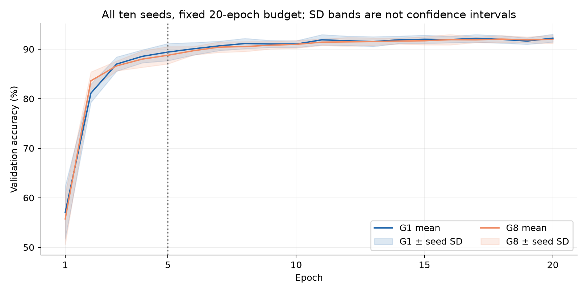

# Appendix: Locality and accuracy in grouped CSDP
**Ning Yang - controlled implementation study**

**Question.** CSDP's author identifies spatially nonlocal goodness modulation and discusses nearby group/helper mechanisms [1,2]. I tested a fixed grouping adaptation: how much immediate trace dependence can be removed, and at what accuracy cost? This is an implementation and sensitivity study, not a new learning principle or a reproduction of the paper's best benchmark score.

**Mechanism and checks.** For equal contiguous groups, binary contrastive label $y$, fixed threshold $\theta=10$ and effective batch $B$,
$$q_{bg}=G\sum_{i\in g}z_{bi}^2-\theta,\qquad L_G=\frac1{BG}\sum_{b,g}\operatorname{BCEWithLogits}(q_{bg},y_b).$$
The modulator is $2z_{bi}[\sigma(q_{bg})-y_b]/B$: no automatic $G$-fold gradient multiplier. Raw batch 98 gives $B=196$ after adding negative examples. G1 matched the original function; direct author-source regression matched 70 arrays after 50 learning steps. Source-level derivatives and perturbations verified each group's immediate dependence. At fixed traces, group logits average to the original logit; BCE convexity means G8 changes the objective. It encourages separate group evidence rather than preserving the same loss.

**Original fixed experiment.** The ten-class scikit-learn digits split contains 1,078 training and 359 validation images (8-by-8). Architecture 64-256-64-10, initial weights, random streams, 141,568 weights, five epochs and 50 simulation steps were paired across 20 seeds. The author's batch heuristic sets actual learning rate 0.001 and activity-dependent decay 0.00007. Validation was previously inspected: intervals describe conditional training-seed variation, not independent-data generalization. No test split or best checkpoint was used.

G1 averaged 89.318% and G8 89.164%; G8-G1 was -0.153 pp, with paired-$t$ 95% interval [-0.765, +0.459]. Its lower bound exceeded the predeclared -1 pp margin. However, **10/20 pairs decreased and 4/20 lost more than 1 pp**; the worst was -3.900 pp. Mean retention does not guarantee each run. All paired outcomes appear in the notebook.

**Locality boundary.** G8 reduces each modulator's immediate trace fan-in from 256/64 to 32/8. All traces remain stored. Recurrent connections, shared labels, readout errors and global threshold feedback remain; no whole-network locality, communication, energy or memory saving is established.

**Future work.** I would first distinguish missing cross-group evidence from changes in objective scaling or saturation. If diagnostics support the former, I would test low-frequency cross-group summaries to correct local modulation under a fixed information budget. Comparisons would include fixed grouping and periodic full-layer correction, accounting for additional state and computation. This reintroduces some nonlocal dependence; improved trade-offs and novelty remain hypotheses requiring direct prior-work comparison and evaluation on data not used for method selection.

\newpage
**Supplementary group curve.** After the original result, I fixed five group counts and ten new seeds 13001-13010. Each group has an epoch 5 endpoint; G1/G8 also continue to epoch 20. Hyperparameters and groups were not selected from the curve. Initial weights, sample order, external keys and passively logged internal encoder keys match within each comparison. An independent five-epoch preflight matched all saved predictions and probabilities.

| G | Modulator fan-in | Epoch 5 accuracy | Difference from G1, pp [interval] |
|---:|:---|---:|:---|
| 1 | 256 / 64 | 89.415% | reference |
| 2 | 128 / 32 | 89.387% | -0.028 [-0.945, +0.890] |
| 4 | 64 / 16 | 89.359% | -0.056 [-1.391, +1.279] |
| 8 | 32 / 8 | 88.774% | -0.641 [-1.683, +0.401] |
| 16 | 16 / 4 | 89.443% | +0.028 [-1.116, +1.172] |

These are four-comparison simultaneous 95% Bonferroni intervals (each 98.75%, df 9), conditional on the reused validation split. Every seed is retained; no best G replaces the original G8 proposal. In the new ten-seed cohort at epoch 5, G8-G1 was -0.641 pp (simultaneous interval [-1.683, +0.401]); this did not re-establish the -1 pp mean-retention criterion.

**Longer budget.** At epoch 20, G1 averaged 92.228% and G8 91.978%. Difference: -0.251 pp, separate paired-$t$ 95% interval [-0.696, +0.194]. The prespecified mean-retention criterion was also met at epoch 20 on these ten seeds. Losses exceeding 1 pp occurred in 1/10 pairs; this frequency is descriptive, not a future-failure probability. The budget-interaction interval includes zero: an improvement in G8 relative to G1 from longer training is not established.

{width=78%}

**Reproducibility and limits.** The notebook checks the actual source, recomputes every saved epoch and trains the first prespecified pair. Predictions from all 90 runs, frozen protocols and reproduction scripts are included; full probability arrays remain in the local archive. Longer training does not prove convergence; this toy does not establish algorithmic novelty, patient privacy, Dale compliance or clinical benefit.

**References.** [1] A. G. Ororbia, *Contrastive signal-dependent plasticity: Self-supervised learning in spiking neural circuits*, Science Advances (2024), [doi:10.1126/sciadv.adn6076](https://doi.org/10.1126/sciadv.adn6076). [2] Author's [arXiv:2303.18187v3](https://arxiv.org/abs/2303.18187v3), supplementary group/helper discussion; distinguished from the formal published main text.
